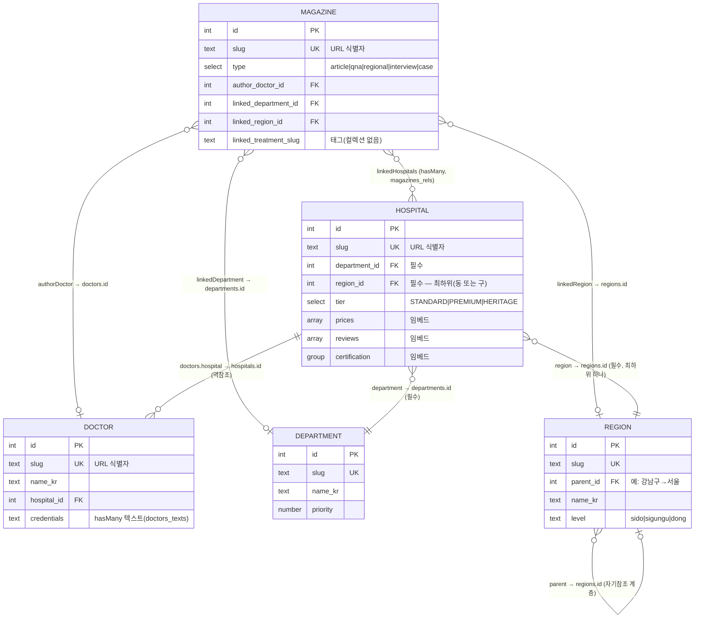

# 메디록 CMS 관계도

메디록의 Payload CMS 컬렉션 간 관계 다이어그램입니다.

> **핵심:** 컬렉션 간 연결은 Payload **`relationship` 필드(FK)** 입니다.
> `/admin`에 관계 피커가 있고, DB에는 `*_id` FK 컬럼 / `magazines_rels` 관계 테이블로 저장됩니다.
> slug는 **URL 식별자 전용**(한국어 SEO URL)이며 데이터 결합에는 쓰이지 않습니다.
> - 필드 정의: `src/payload/collections/*.ts`
> - DB 형태 → flat 타입 변환: `src/lib/payload-mappers.ts` (FK 체인에서 flat slug 파생)
> - 조인/조회: `src/lib/hospitals-data.ts`, `src/lib/magazines-data.ts`
>
> 2026-07 slug→FK 전환 완료. 배경/단계는 [db-reference-migration-plan.md](./db-reference-migration-plan.md),
> 운영 적용은 [prod-migration-runbook.md](./prod-migration-runbook.md) 참조.

## ER 다이어그램

## 범례 / 주의

- **실제 Payload 컬렉션(테이블):** `magazines`, `hospitals`, `doctors`, `departments`, `regions`, `media`, `users`
- **DOCTOR** 는 **독립 컬렉션**입니다(2026-07 임베드 배열에서 승격). 의사→의원은 `doctors.hospital` FK로, 의원→의사는 역참조(`getDoctorsByHospitalSlug`)로 조회합니다.
- **HOSPITAL.region** 은 **최하위 지역 하나**(동 또는 구)만 FK로 가리키고, 상위 시도/구는 `region.parent` 체인으로 해석합니다(구 sidoSlug/regionSlug/dongSlug 3필드 대체).
- **TREATMENT** 는 컬렉션이 없습니다. `Magazine.linkedTreatmentSlug` 는 단순 문자열 태그(관련 매거진 필터에만 사용).
- `media`(미디어), `users`(관리자)는 콘텐츠 관계에 참여하지 않아 다이어그램에서 생략했습니다.
- 카디널리티 표기: `||`=정확히 1, `}o`=0개 이상(다), `o|`=0 또는 1.

## 관계별 해석 함수 & 노출 위치

| 관계 | 해석 함수 (`src/lib/*-data.ts`) | 화면 노출 |
|---|---|---|
| Hospital → Department | `getDepartmentBySlug` | HospitalCard·CurationCard·의원 상세 브레드크럼 |
| Hospital → Region | `getRegionBySlug` / `getSidoRegion` / `getSigunguRegion` | 의원 목록/지역 페이지 |
| Region → Region(parent) | `getRegionsByParent` / `getChildRegions` / `getRegionPath` | 진료과 페이지의 지역 필터, 브레드크럼 |
| Hospital ⇄ Doctor | `getDoctorBySlug` / `getHospitalByDoctorSlug` / `getDoctorsByHospitalSlug` | 의원 상세 의료진, 매거진 저자 박스 |
| Magazine → Hospital[] | `getMagazinesByHospital` (역방향), 상세 `linkedHospitals` populate | 매거진 상세 "관련 메디록 의원" |
| Magazine → Doctor(author) | `getDoctorBySlug` → `getHospitalByDoctorSlug` | 매거진 저자 프로필 + 의원 cross-link |
| Doctor(의원 소속) → Magazine[] | `getMagazinesByDoctorSlugs` / `getMagazinesByAuthorDoctorSlug` | 의원 상세 "이 의원 의료진이 쓴 매거진" |
| Magazine → Department | `getMagazinesByDepartment` / `getRelatedMagazines` | 매거진 상세 "관련 매거진" |

> **관계 조회 성능**: 지역×진료과 목록(`getHospitalsByDeptAndRegion`)은 관계 `where`(IN) 단일 쿼리로 조회합니다.
> 프론트엔드 컴포넌트는 여전히 flat 타입(slug 필드 포함)을 받습니다 — `payload-mappers`가 FK 체인에서 파생하므로 계약 불변.
