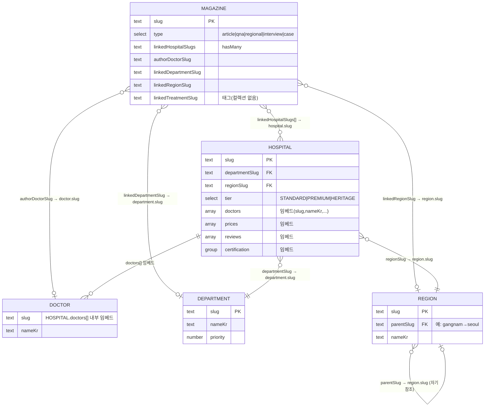

# 메디록 CMS 관계도

메디록의 Payload CMS 컬렉션 간 관계 다이어그램입니다.

> **핵심:** 컬렉션 간 연결은 Payload `relationship` 필드가 아니라 **slug 텍스트 기반 소프트 링크**입니다.
> `/admin`에는 관계 피커가 없고 slug 값으로만 보입니다. 실제 조인은 아래 데이터 액세스 모듈이 수행합니다.
> - 필드 정의: `src/payload/collections/*.ts`
> - 조인 로직: `src/lib/hospitals-data.ts`, `src/lib/magazines-data.ts`

## ER 다이어그램

## 범례 / 주의

- **실제 Payload 컬렉션(테이블):** `magazines`, `hospitals`, `departments`, `regions`, `media`, `users`
- **DOCTOR** 는 독립 컬렉션이 아니라 `HOSPITAL.doctors[]` 에 **임베드**된 항목입니다. 의사↔의원 조회는 전체 의원을 순회해서 slug로 찾습니다.
- **TREATMENT** 는 컬렉션이 없습니다. `Magazine.linkedTreatmentSlug` 는 단순 문자열 태그(관련 매거진 필터에만 사용).
- `media`(미디어), `users`(관리자)는 콘텐츠 관계에 참여하지 않아 다이어그램에서 생략했습니다.
- 카디널리티 표기: `||`=정확히 1, `}o`=0개 이상(다), `o|`=0 또는 1.

## 관계별 해석 함수 & 노출 위치

| 관계 | 해석 함수 | 화면 노출 |
|---|---|---|
| Hospital → Department | `getDepartmentBySlug` | HospitalCard·CurationCard·의원 상세 브레드크럼 |
| Hospital → Region | `getRegionBySlug` | 의원 목록/지역 페이지 |
| Region → Region(parent) | `getRegionsByParent` | 진료과 페이지의 지역 필터 |
| Hospital ⇄ Doctor(임베드) | `getDoctorBySlug` / `getHospitalByDoctorSlug` / `getDoctorsByHospitalSlug` | 의원 상세 의료진, 매거진 저자 박스 |
| Magazine → Hospital[] | 매거진 상세 `linkedHospitals` 필터 | 매거진 상세 "관련 메디록 의원" |
| Magazine → Doctor(author) | `getDoctorBySlug` → `getHospitalByDoctorSlug` | 매거진 저자 프로필 + 의원 cross-link |
| Doctor(의원 소속) → Magazine[] | `getMagazinesByDoctorSlugs` | 의원 상세 "이 의원 의료진이 쓴 매거진" |
| Magazine → Department/Treatment | 매거진 상세 관련 글 필터 | 매거진 상세 "관련 매거진" |
